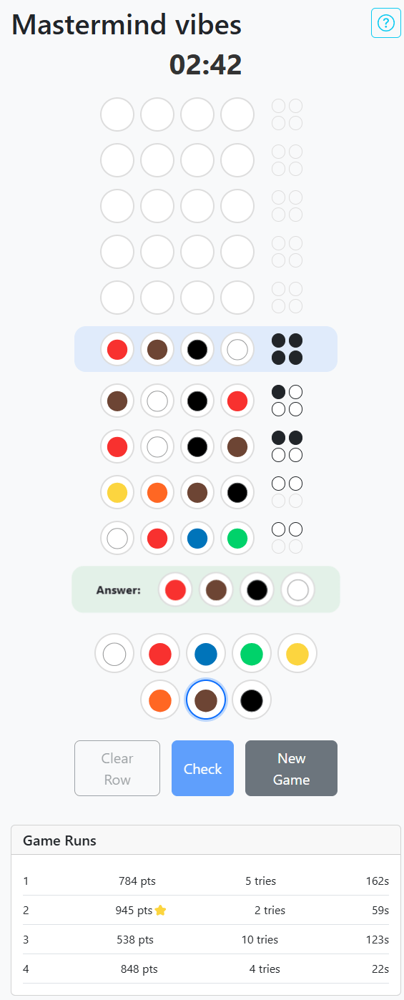

# [MasterMind Vibes](https://fatbattk.github.io/game-mastermind/)

A _vibe coding experiment_ with DeepSeek + Replit + Claude.

<table>
<tr><td valign="top">

## Features

- 🎮 Classic Mastermind gameplay
- 🏆 Local high score tracking
- 🔊 Sound effects
- 📱 Responsive design for mobile and desktop

## How to Play

1. The computer selects a secret code consisting of 4 colored emoji pegs
2. You make guesses by selecting colors and placing them in the current row
3. After each guess, you receive feedback:
   - ⬛ Black peg: Right color in the right position
   - ⬜ White peg: Right color in the wrong position
4. Try to crack the code in 10 attempts or fewer
5. Score more points by solving the puzzle quickly with fewer attempts
</td><td valign="top">



</td></tr>
</table>

## Development

```bash
# Install dependencies
yarn

# Start the development server
yarn dev

# Build for production
yarn build
```

### Afterthoughts 💭

- Took 3+ hours (mostly AFK).
- Claude 3.7-sonnet is expensive! $10+ used.
- AI still not good at knowing what proper design is. Padding, alignments, etc.
- Single word typo cost ~$3 and probably caused leftovers in code.
- Great at adding code, but does not clean up after itself.
- Had to reset at one point cause the frankenstein went rogue and telling AI to "audi and delete" did not help.
- Unusually difficult to divert AI back to the intended path.
- Thoughts: Not worth. Will vibe moar harder better next time. 💪🏻
